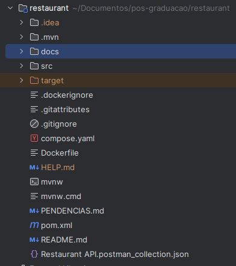
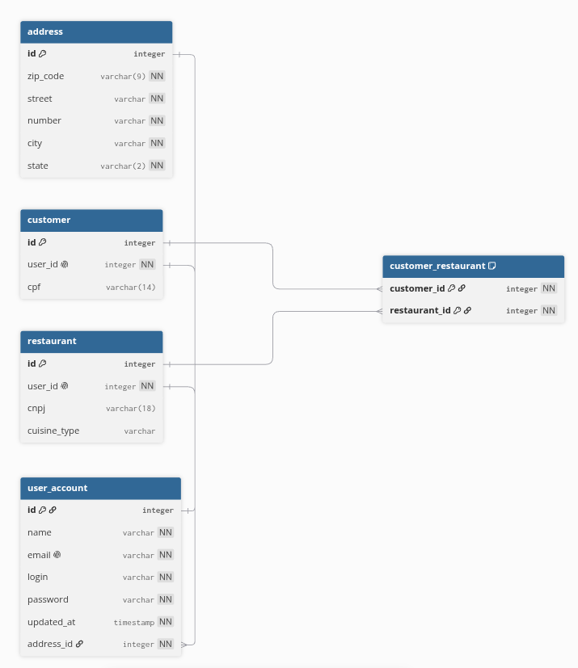
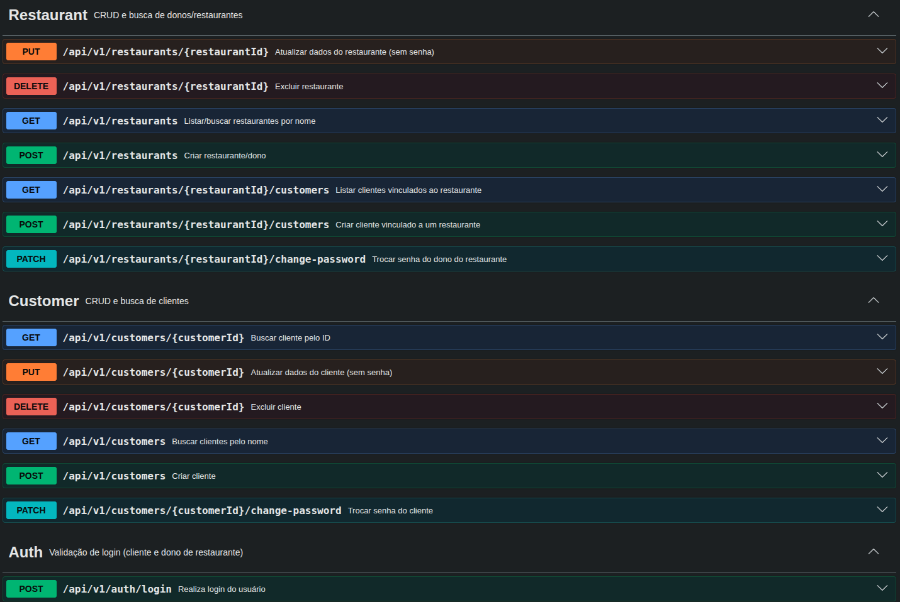
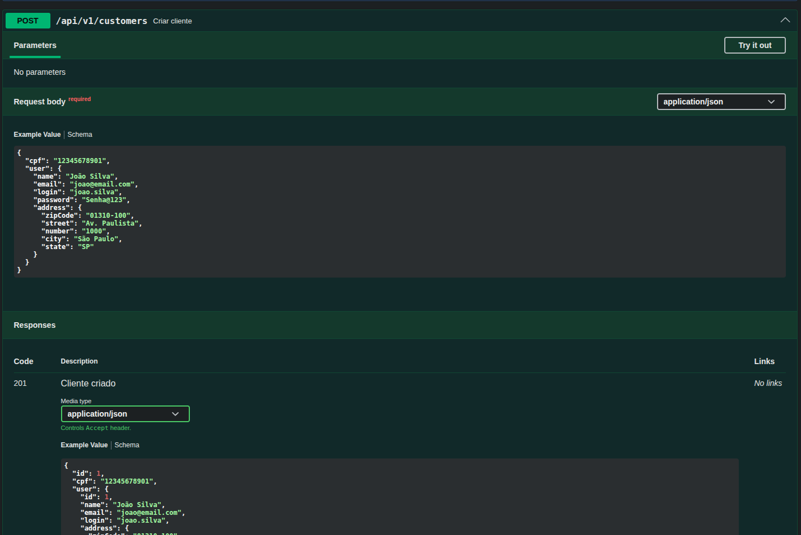
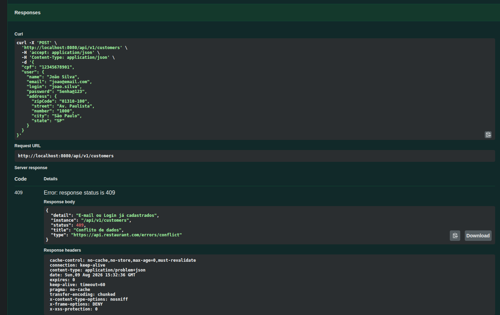
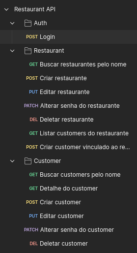
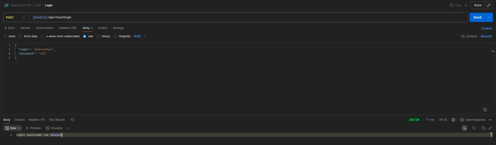
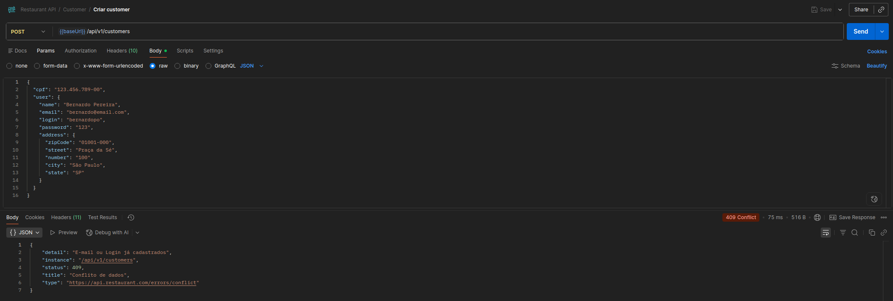
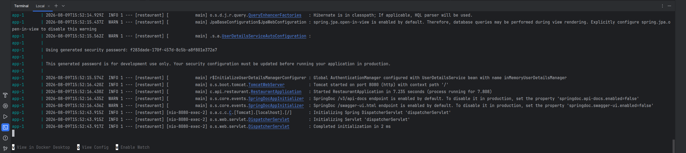

# Relatório Técnico — Restaurant API

> Rascunho do entregável oficial em **PDF**.  
> Preencher a capa e exportar este Markdown para PDF. As imagens estão em `docs/imagens/`.

---

## Capa / identificação

| Campo | Valor |
|---|---|
| **Título** | Relatório Técnico — Restaurant API |
| **Autor** | Bernardo Pereira Oliveira |
| **RM** | 375854 |
| **Curso / pós-graduação** | Arquitetura e Desenvolvimento Java |
| **Instituição** | FIAP |
| **Turma / disciplina** | 13ADJT |
| **Data** | 09/08/2026 |
| **Repositório** | https://github.com/BernardoSemiOficial/api-restaurante |

---

## Sumário

1. [Descrição da arquitetura da aplicação](#1-descrição-da-arquitetura-da-aplicação)
2. [Modelagem das entidades e relacionamentos](#2-modelagem-das-entidades-e-relacionamentos)
3. [Descrição dos endpoints](#3-descrição-dos-endpoints)
4. [Documentação Swagger / OpenAPI](#4-documentação-swagger--openapi)
5. [Coleção Postman](#5-coleção-postman)
6. [Estrutura do banco de dados](#6-estrutura-do-banco-de-dados)
7. [Execução com Docker Compose](#7-execução-com-docker-compose)
8. [Tratamento de erros (ProblemDetail)](#8-tratamento-de-erros-problemdetail)

---

## 1. Descrição da arquitetura da aplicação

A **Restaurant API** é uma aplicação backend REST desenvolvida em **Spring Boot**, responsável pelo cadastro e gestão de dois tipos de usuário: **cliente** (`Customer`) e **dono de restaurante** (`Restaurant`). Ambos compartilham dados comuns por meio da entidade `User` (nome, e-mail, login, senha, data da última alteração e endereço).

A arquitetura segue o padrão em camadas típico de aplicações Spring:

```
Cliente HTTP (Postman / Swagger UI / frontend)
        │
        ▼
   Controllers  (/api/v1/...)
        │
        ▼
    Services    (regras de negócio, validação, BCrypt)
        │
        ▼
  Repositories  (Spring Data JPA)
        │
        ▼
   PostgreSQL   (schema em schema-restaurant.sql)
```

### 1.1 Componentes principais

| Camada | Pacote | Responsabilidade |
|---|---|---|
| API | `controller` | Expõe endpoints REST versionados em `/api/v1` |
| Negócio | `service` | CRUD, login, unicidade de e-mail, hash de senha |
| Persistência | `repository` | Acesso a `Customer`, `Restaurant` e `User` |
| Modelo | `model` | Entidades JPA |
| Contratos | `interfaces` | DTOs de request e response |
| Configuração | `config` | Security (BCrypt) e OpenAPI (SpringDoc) |
| Erros | `exception` | `GlobalExceptionHandler` com ProblemDetail (RFC 7807) |

### 1.2 Decisões de arquitetura

- **Versionamento por path:** todos os endpoints públicos da API estão sob `/api/v1/...`.
- **Dois tipos de usuário:** `Customer` e `Restaurant`, cada um com um `User` associado (relação 1:1).
- **Senha:** armazenada com **BCrypt**; alteração somente via `PATCH .../change-password`.
- **Atualização de perfil:** endpoint `PUT` distinto, sem campo de senha no DTO de edição.
- **Erros:** padronizados com **ProblemDetail** (RFC 7807) — status 400, 401, 404 e 409.
- **E-mail único:** constraint no banco e validação prévia via `UserRepository.findByEmail` (abrangendo cliente e dono).
- **Infraestrutura:** `Dockerfile` multi-stage e `compose.yaml` com PostgreSQL e serviço `app` (profile `full`).

**Figura 1 — Estrutura de pastas / camadas do projeto**



---

## 2. Modelagem das entidades e relacionamentos

O domínio modela usuários genéricos com endereço, especializados em cliente ou dono de restaurante, e um vínculo **N:N** entre clientes e restaurantes.

### 2.1 Diagrama lógico

```
Address 1 ─── 1 User
                │
        ┌───────┴────────┐
        │                │
   Customer 1        Restaurant 1
        │                │
        └────── N:N ─────┘
         (customer_restaurant)
```

### 2.2 Entidades

**Address**  
Representa o endereço do usuário: CEP (`zipCode`), rua, número, cidade e estado.

**User** (`user_account`)  
Dados comuns: nome, e-mail (**UNIQUE**), login, senha (hash BCrypt), `updatedAt` e referência a `Address`.

**Customer**  
Cliente do sistema: referência 1:1 a `User` e CPF.

**Restaurant**  
Dono/estabelecimento: referência 1:1 a `User`, CNPJ e tipo de cozinha (`cuisineType`).

**Relacionamento N:N**  
A tabela pivô `customer_restaurant` associa clientes a restaurantes (por exemplo, cliente criado já vinculado a um restaurante).

**Figura 2 — Diagrama de entidades e relacionamentos (DER)**



---

## 3. Descrição dos endpoints

**Base URL local:** `http://localhost:8080`  
**Prefixo da API:** `/api/v1`

### 3.1 Auth

#### `POST /api/v1/auth/login`

Valida login e senha para **cliente** ou **dono de restaurante**.

**Request:**

```json
{
  "login": "joao.silva",
  "password": "Senha@123"
}
```

**Sucesso (200):**

```text
Login realizado com sucesso
```

**Erro (401)** — ProblemDetail:

```json
{
  "type": "https://api.restaurant.com/errors/unauthorized",
  "title": "Não autorizado",
  "status": 401,
  "detail": "Não foi possível realizar o login"
}
```

### 3.2 Customers

| Método | Path | Descrição |
|---|---|---|
| `GET` | `/api/v1/customers?customerName=João` | Busca por nome |
| `GET` | `/api/v1/customers/{id}` | Busca por ID |
| `POST` | `/api/v1/customers` | Cadastro |
| `PUT` | `/api/v1/customers/{id}` | Atualização de dados (**sem senha**) |
| `PATCH` | `/api/v1/customers/{id}/change-password` | Troca de senha |
| `DELETE` | `/api/v1/customers/{id}` | Exclusão |

#### Exemplo — criar cliente (`POST /api/v1/customers`)

```json
{
  "cpf": "12345678901",
  "user": {
    "name": "João Silva",
    "email": "joao@email.com",
    "login": "joao.silva",
    "password": "Senha@123",
    "address": {
      "zipCode": "01310-100",
      "street": "Av. Paulista",
      "number": "1000",
      "city": "São Paulo",
      "state": "SP"
    }
  }
}
```

- **Sucesso:** `201 Created` com o corpo do cliente criado.  
- **E-mail ou login duplicado:** `409 Conflict` (ProblemDetail).

#### Exemplo — troca de senha (`PATCH .../change-password`)

```json
{
  "currentPassword": "Senha@123",
  "newPassword": "NovaSenha@456"
}
```

- **Sucesso:** `200 OK`.  
- **Senha atual incorreta:** `400 Bad Request` (ProblemDetail).

### 3.3 Restaurants

| Método | Path | Descrição |
|---|---|---|
| `GET` | `/api/v1/restaurants?restaurantName=` | Lista/busca por nome |
| `POST` | `/api/v1/restaurants` | Cadastro do dono/restaurante |
| `PUT` | `/api/v1/restaurants/{id}` | Atualização (**sem senha**) |
| `PATCH` | `/api/v1/restaurants/{id}/change-password` | Troca de senha |
| `DELETE` | `/api/v1/restaurants/{id}` | Exclusão |
| `GET` | `/api/v1/restaurants/{id}/customers` | Clientes vinculados ao restaurante |
| `POST` | `/api/v1/restaurants/{id}/customers` | Cria cliente já vinculado |

#### Exemplo — criar restaurante (`POST /api/v1/restaurants`)

```json
{
  "cnpj": "12345678000199",
  "cuisineType": "Italiana",
  "user": {
    "name": "Maria Souza",
    "email": "maria@restaurante.com",
    "login": "maria.souza",
    "password": "Senha@123",
    "address": {
      "zipCode": "01310-100",
      "street": "Av. Paulista",
      "number": "500",
      "city": "São Paulo",
      "state": "SP"
    }
  }
}
```

- **Sucesso:** `201 Created`.  
- **Conflito de e-mail/login:** `409 Conflict` (ProblemDetail).

---

## 4. Documentação Swagger / OpenAPI

A API utiliza **SpringDoc OpenAPI** (`springdoc-openapi-starter-webmvc-ui`) para gerar a documentação interativa a partir das anotações nos controllers e DTOs.

| Recurso | URL |
|---|---|
| Swagger UI | http://localhost:8080/swagger-ui/index.html |
| OpenAPI JSON | http://localhost:8080/v3/api-docs |

### O que está documentado

- Tags: **Auth**, **Customer** e **Restaurant**
- Operações com `@Operation` e `@ApiResponses`
- Exemplos de sucesso e de erro (incluindo ProblemDetail para 400, 401, 404 e 409)
- Schemas dos DTOs com `@Schema` e exemplos de campos
- Metadados em `OpenApiConfig` (título, descrição e versão `v1`)

Com a aplicação em execução, a Swagger UI permite explorar os endpoints, visualizar contratos e enviar requisições de teste diretamente pelo navegador.

**Figura 3 — Swagger UI: lista de endpoints**



**Figura 4 — Swagger UI: detalhe de uma operação**



**Figura 5 — Swagger UI: resposta de erro ProblemDetail**



---

## 5. Coleção Postman

A coleção de testes está versionada na raiz do repositório:

**Arquivo:** `Restaurant API.postman_collection.json`

### Como usar

1. Importar o JSON no Postman.  
2. Ajustar as variáveis da coleção, se necessário:
   - `baseUrl` — padrão `http://localhost:8080`
   - `restaurantId` / `customerId` — IDs obtidos após o cadastro
3. Executar os requests nas pastas **Auth**, **Restaurant** e **Customer**.

### Cobertura da coleção

| Pasta | Cobertura |
|---|---|
| **Auth** | `POST /api/v1/auth/login` |
| **Restaurant** | Busca por nome, CRUD, change-password, listagem e criação de customers do restaurante |
| **Customer** | Busca por nome/ID, CRUD e change-password |

### Cenários do enunciado

1. **Cadastro válido** — `POST` de cliente e de restaurante/dono.  
2. **Cadastro inválido** — reutilizar o mesmo `POST` com e-mail ou login já existente (espera **409** ProblemDetail).  
3. **Alteração de senha** — `PATCH .../change-password` (sucesso e senha atual incorreta → **400**).  
4. **Atualização de dados** — `PUT` sem senha (sucesso e conflito de e-mail → **409**).  
5. **Busca por nome** — query `customerName` / `restaurantName`.  
6. **Validação de login** — `POST /api/v1/auth/login`.

**Figura 6 — Postman: pastas da coleção**



**Figura 7 — Postman: request de sucesso**



**Figura 8 — Postman: request de erro**



---

## 6. Estrutura do banco de dados

O schema é definido em `src/main/resources/schema-restaurant.sql` e aplicado na inicialização (`spring.sql.init.mode=always`), com `spring.jpa.hibernate.ddl-auto=none` para evitar conflito com o Hibernate.

O banco utilizado é **PostgreSQL**, executado em container Docker conforme o `compose.yaml`.

### 6.1 Tabelas

| Tabela | Colunas principais |
|---|---|
| `address` | `id`, `zip_code`, `street`, `number`, `city`, `state` |
| `user_account` | `id`, `name`, `email` (UNIQUE), `login`, `password`, `updated_at`, `address_id` |
| `customer` | `id`, `user_id` (UNIQUE), `cpf` |
| `restaurant` | `id`, `user_id` (UNIQUE), `cnpj`, `cuisine_type` |
| `customer_restaurant` | `customer_id`, `restaurant_id` (PK composta) |

### 6.2 Relacionamentos (chaves estrangeiras)

- `user_account.address_id` → `address.id`
- `customer.user_id` → `user_account.id`
- `restaurant.user_id` → `user_account.id`
- `customer_restaurant.customer_id` → `customer.id`
- `customer_restaurant.restaurant_id` → `restaurant.id`

**Figura 9 — Estrutura do banco (DER)**

O diagrama físico das tabelas corresponde ao DER da seção 2 (Figura 2).


---

## 7. Execução com Docker Compose

A aplicação e o banco sobem juntos por meio do arquivo `compose.yaml` (equivalente ao `docker-compose.yml` pedido no enunciado).

### 7.1 Serviços

| Serviço | Função |
|---|---|
| `postgres` | Banco PostgreSQL (sempre disponível no Compose) |
| `app` | API Spring Boot (profile Compose `full`) |

### 7.2 Passo a passo

1. Clonar o repositório:

```bash
git clone git@github.com:BernardoSemiOficial/api-restaurante.git
cd api-restaurante
```

2. Subir aplicação e banco:

```bash
docker compose --profile full up --build
```

3. Aguardar o healthcheck do Postgres e a inicialização da API.

4. Validar:

- Swagger UI: http://localhost:8080/swagger-ui/index.html  
- Após cadastrar um usuário (`POST /api/v1/customers` ou `/api/v1/restaurants`), testar o login em `POST /api/v1/auth/login`.

5. Parar os containers:

```bash
docker compose --profile full down
```

**Figura 10 — Docker Compose em execução**



### 7.3 Variáveis de ambiente da aplicação (Compose)

```text
SPRING_DATASOURCE_URL=jdbc:postgresql://postgres:5432/restaurant
SPRING_DATASOURCE_USERNAME=postgres
SPRING_DATASOURCE_PASSWORD=postgres
SPRING_DOCKER_COMPOSE_ENABLED=false
```

### 7.4 Variáveis do Postgres

```text
POSTGRES_DB=restaurant
POSTGRES_USER=postgres
POSTGRES_PASSWORD=postgres
```

Porta publicada no host: **5436** → `5432` no container.

### 7.5 Dockerfile

Build **multi-stage**:

1. Imagem `eclipse-temurin:25-jdk` — compila o projeto com Maven Wrapper.  
2. Imagem `eclipse-temurin:25-jre` — executa o JAR `restaurant-0.0.1-SNAPSHOT.jar`.

---

## 8. Tratamento de erros (ProblemDetail)

Os erros da API são centralizados em `GlobalExceptionHandler` e devolvidos no padrão **ProblemDetail** (RFC 7807), com `Content-Type: application/problem+json`.

| Status | Exceção típica | Situação |
|---|---|---|
| `404` | `EntityNotFoundException` | Recurso não encontrado |
| `400` | `IllegalArgumentException` | Ex.: senha atual incorreta |
| `401` | `UnauthorizedException` | Login ou senha inválidos |
| `409` | `DataIntegrityViolationException` | E-mail ou login duplicado |

Esse padrão garante respostas de erro consistentes para consumo via Postman, Swagger UI ou qualquer cliente HTTP.

---

## Como finalizar o PDF

1. Exportar este arquivo para **PDF** (Pandoc, Word, Google Docs ou ferramenta equivalente), garantindo que as figuras de `docs/imagens/` sejam incluídas.  
2. Submeter o PDF como entregável oficial; o código permanece no GitHub.
